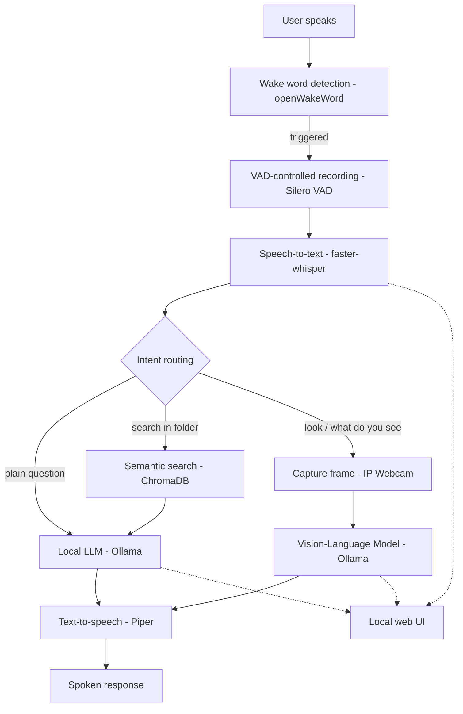

# Local Voice Assistant

A fully local, voice-activated assistant: wake word detection, speech-to-text,
a local LLM for conversation, semantic search over your own files, a
vision model that can look through a webcam, and natural-sounding
text-to-speech — all running offline, with zero paid APIs or subscriptions.

Built as a technical portfolio project, with a focus on real-time audio
pipelines, local LLM/VLM orchestration, and semantic search.

## Features

- **Wake word activation** ("Alexa" by default) via openWakeWord, fully offline
- **Voice Activity Detection** (Silero VAD): the assistant knows when you've
  stopped talking, no fixed recording duration
- **Local speech-to-text** with faster-whisper (GPU-accelerated)
- **Local conversational LLM** via Ollama, with short-term memory across turns
- **Semantic file search**: ask the assistant to search inside known folders
  (PDF, Markdown, text, Python files) — it indexes them into a local vector
  store and answers citing the source file and page
- **Vision**: point a phone camera (via IP Webcam / DroidCam) at something
  and ask the assistant what it sees, using a local Vision-Language Model
- **Natural local text-to-speech** via Piper (Italian voice by default)
- **Live web UI**: a minimal browser page shows the conversation in real time
  while you talk to the assistant

## Architecture



## Tech stack

| Component                   | Technology                                                  |
|------------------------------|---------------------------------------------------------------|
| Language                      | Python 3.10+                                                     |
| Wake word                       | openWakeWord                                                        |
| Voice activity detection          | Silero VAD (via Torch Hub)                                              |
| Speech-to-text                        | faster-whisper (CUDA)                                                        |
| Local LLM / VLM                          | Ollama — `qwen2.5:7b` (chat), `qwen2.5vl:3b` (vision)                             |
| Text-to-speech                              | Piper (`it_IT-serena-medium` voice)                                                    |
| Vector store / embeddings                       | ChromaDB + `paraphrase-multilingual-MiniLM-L12-v2`                                           |
| PDF parsing                                         | pypdf                                                                                               |
| Vision input                                           | OpenCV + IP Webcam / DroidCam (phone as camera)                                                        |
| Local web UI                                               | FastAPI + WebSocket                                                                                        |
| Config                                                         | python-dotenv                                                                                                  |

## Hardware notes

Developed and tested on an RTX 3080 (10-12GB VRAM), where `qwen2.5vl:3b`
runs comfortably alongside the rest of the pipeline. On GPUs with less
VRAM, the full stack — Whisper, the chat LLM, and
a VLM — can exceed available memory when models overlap. If you hit
out-of-memory issues:
- switch `VLM_MODEL` to a lighter model
- consider a smaller Whisper size (`WHISPER_MODEL_SIZE=base`) or a smaller
  chat LLM
- Ollama unloads idle models automatically, so sequential (not simultaneous)
  use of the LLM and VLM is the safer default

## Setup

### 1. Python environment

```bash
python -m venv venv
source venv/bin/activate  # on Windows: venv\Scripts\activate
pip install -r requirements.txt
```

### 2. Ollama and models

Install [Ollama](https://ollama.com), then pull the models:

```bash
ollama pull qwen2.5:7b
ollama pull qwen2.5vl:7b
```

### 3. faster-whisper CUDA DLLs (Windows only)

faster-whisper's GPU backend needs cuBLAS/cuDNN DLLs that aren't reliably
installable via pip on Windows. Download the **Faster-Whisper-XXL**
standalone release from
[Purfview/whisper-standalone-win](https://github.com/Purfview/whisper-standalone-win/releases),
extract it, and locate the folder containing `cublas64_12.dll` (typically
`..._xxl_data\torch\lib`). You'll point `FASTER_WHISPER_DLL_DIR` at it in
the next step.

### 4. Piper TTS voice

Download an Italian voice (`.onnx` + `.onnx.json`) from
[rhasspy/piper-voices](https://huggingface.co/rhasspy/piper-voices/tree/main/it/it_IT),
e.g. `it_IT-serena-medium`, and place both files in the project root.

### 5. Configuration

```bash
cp .env.example .env
```

Edit `.env` with your real values: the DLL path from step 3, your camera
stream URL (from the IP Webcam / DroidCam app on your phone), and any model
overrides.

### 6. Folders to search (optional)

Edit `KNOWN_FOLDERS` in `rag_engine.py` with spoken aliases mapped to real
folder paths, e.g.:

```python
KNOWN_FOLDERS = {
    "thesis": r"C:\Users\you\Documents\Thesis",
    "project code": r"C:\Users\you\Documents\MyProject",
}
```

Then index them once, with the assistant closed (so RAM/VRAM are fully free):

```bash
python index_folders.py
```

This can be interrupted and rerun safely — it resumes from where it left off.

## Usage

**One-command start** (Windows):

```bash
launcher.bat
```

This starts the local web UI, opens it in your browser, and starts the
voice pipeline.

**Manual start**, in two terminals:

```bash
# Terminal 1
uvicorn server:app --host 0.0.0.0 --port 8000

# Terminal 2
python voice_pipeline.py
```

Then say "Alexa" to start a conversation. Example commands:

- *Plain chat*: "Come stai?"
- *File search*: "Cerca nel progetto codice la funzione di chunking"
- *Vision*: "Guarda, cosa tengo in mano?"

## Project structure

```
.
├── voice_pipeline.py     # Main loop: wake word, VAD, STT, routing, TTS
├── rag_engine.py          # Semantic search over known folders (ChromaDB)
├── vision_engine.py        # Webcam capture + VLM query (Ollama)
├── index_folders.py         # Offline indexing script for rag_engine.py
├── server.py                 # Local web UI (FastAPI + WebSocket)
├── wake_word.py                # Standalone wake-word test script
├── config.py                     # Central configuration (reads from .env)
├── launcher.bat                    # One-command start (Windows)
├── .env.example                      # Configuration template
└── requirements.txt                    # Python dependencies
```

## Known limitations & future work

- Conversational memory lives in a plain Python list, lost on restart —
  fine for a single session, not persisted across runs
- Scanned (image-only) PDFs aren't readable by the file search: there's no
  OCR step yet
- The folder-search embedding model truncates input at ~128 tokens per
  chunk; very long unbroken paragraphs may lose some context
- No automated tests yet
- Vision and file-search intents are detected via keyword matching, not a
  general-purpose intent classifier — works reliably for the phrasings
  it's tuned for, but isn't as flexible as true NLU
- Possible extensions: OCR for scanned documents, barge-in (interrupting
  the assistant mid-reply), multi-folder search in a single query
